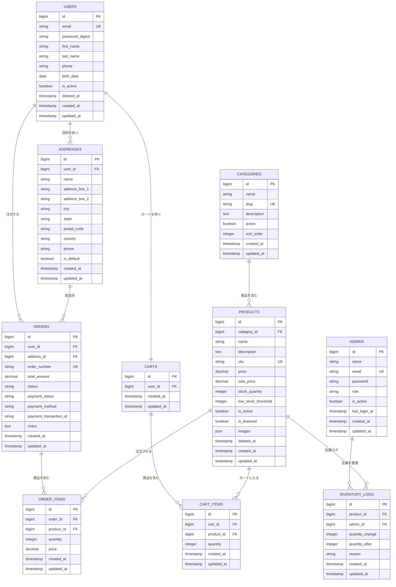

# ER図

## テーブル関連図

## 補足

- usersテーブルにはRails用のカラム（password_digest等）とLaravel用のカラム（password等）が両方存在する。RailsとLaravelで同一のDBを参照しているため、このような構成になっている
- ordersのstatusは文字列で管理している（pending, confirmed, shipped等）。integerでの管理も検討したが、可読性を優先して文字列を採用した
- deleted_atカラムがあるテーブルは論理削除を使用している。注文履歴の保持が必要なため、ユーザーや商品は物理削除しない方針とした
- emailやSKUなど検索頻度の高いカラムにはインデックスを付与している
