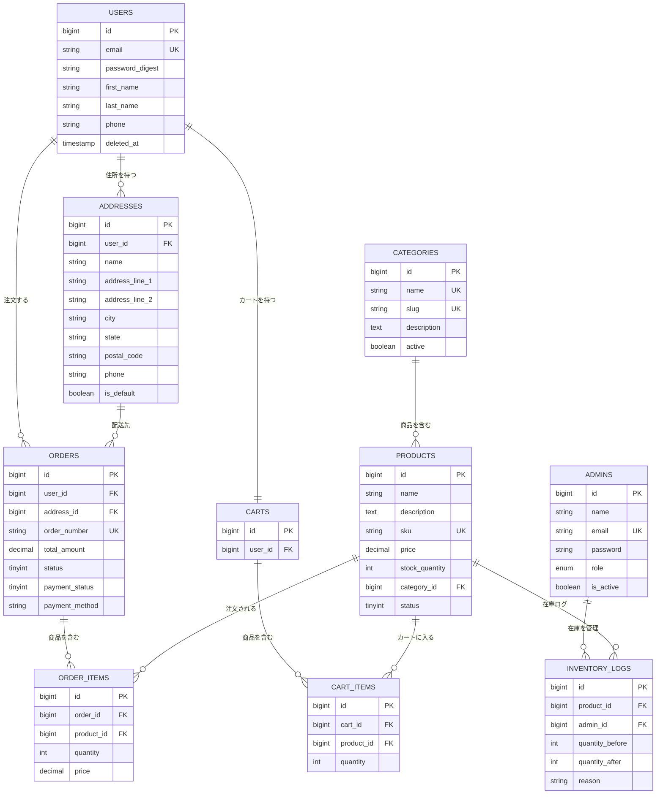

# システム設計書

## 1. システム概要

Amazon風のECサイトを構築するプロジェクトです。
ユーザー向けの機能と管理者向けの機能を、それぞれ別のバックエンドAPIで分離して実装しています。

## 2. アーキテクチャ

### システム構成図

```
  ブラウザ (React)
      |
      |  API通信
      |
  +---+---+--------+
  |                 |
  v                 v
User API        Admin API
(Rails)         (Laravel)
  |                 |
  +---+---+---------+
      |
      v
   MySQL 8.0
      |
   Redis
```

### アーキテクチャ選定理由

**マイクロサービス構成を採用した理由**

課題の要件で「ユーザー側はRails、管理側はLaravel」と指定されていたため、自然とマイクロサービス構成となりました。
サービスを分離することで、互いの変更が影響しにくくなるというメリットもあります。

**フロントエンド: React + TypeScript**

- 課題の指定技術
- TypeScriptを導入することで、型チェックによるバグの早期発見が可能になる
- Material-UIを採用し、UIの統一感を確保した

**ユーザー向けAPI: Rails**

- 課題の指定技術
- RESTfulなAPI開発に適している
- ActiveRecordにより、直感的なDB操作が可能

**管理者向けAPI: Laravel**

- 課題の指定技術
- Eloquent ORMによるDB操作が扱いやすい
- JWT認証のライブラリが充実している

**データベース: MySQL 8.0**

- 課題の指定技術
- ECサイトではトランザクションの信頼性が重要であるため、RDBMSを選択
- トランザクション機能があるので、注文データが途中で壊れにくい

**セッション: Redis**

- 課題の指定（ファイル保存は不可）
- メモリ上で動作するため、高速なセッション管理が可能

## 3. データベース設計

### ER図



## コンポーネント図

```
┌─────────────────────────────────────────────────┐
│                   Frontend                       │
│                  (React App)                     │
│                                                  │
│  ┌──────────┐ ┌──────────┐ ┌──────────────────┐ │
│  │  Pages   │ │Components│ │    Contexts       │ │
│  │ ・Home   │ │ ・Header │ │ ・AuthContext     │ │
│  │ ・Product│ │ ・Footer │ │ ・CartContext     │ │
│  │ ・Cart   │ │ ・Forms  │ │ ・ThemeContext    │ │
│  │ ・Order  │ │ ・Cards  │ │                   │ │
│  │ ・Admin  │ │          │ │                   │ │
│  └──────────┘ └──────────┘ └──────────────────┘ │
│  ┌──────────────────────────────────────────────┐│
│  │              Services (API通信)              ││
│  │  authService / productService / cartService  ││
│  │  orderService / adminAuthService ...         ││
│  └──────────────────────────────────────────────┘│
└──────────────┬────────────────────┬──────────────┘
               │ HTTP (JWT)         │ HTTP (JWT)
               ▼                    ▼
┌──────────────────────┐ ┌──────────────────────────┐
│   User API (Rails)   │ │   Admin API (Laravel)    │
│                      │ │                          │
│ ┌──────────────────┐ │ │ ┌──────────────────────┐ │
│ │   Controllers    │ │ │ │    Controllers       │ │
│ │ ・Auth           │ │ │ │ ・AdminAuth          │ │
│ │ ・Products       │ │ │ │ ・AdminProduct       │ │
│ │ ・Cart           │ │ │ │ ・AdminOrder         │ │
│ │ ・Orders         │ │ │ │ ・AdminInventory     │ │
│ │ ・Addresses      │ │ │ │ ・AdminCategory      │ │
│ └──────────────────┘ │ │ └──────────────────────┘ │
│ ┌──────────────────┐ │ │ ┌──────────────────────┐ │
│ │     Models       │ │ │ │      Models          │ │
│ │ ・User           │ │ │ │ ・Admin              │ │
│ │ ・Product        │ │ │ │ ・Product            │ │
│ │ ・Cart           │ │ │ │ ・Order              │ │
│ │ ・Order          │ │ │ │ ・InventoryLog       │ │
│ │ ・Address        │ │ │ │ ・Category           │ │
│ └──────────────────┘ │ │ └──────────────────────┘ │
└──────────┬───────────┘ └─────────────┬────────────┘
           │                           │
           ▼                           ▼
┌──────────────────────────────────────────────────┐
│                  MySQL 8.0                        │
│  (users, products, orders, carts, admins, ...)   │
└──────────────────────────────────────────────────┘
           │
           ▼
┌──────────────────────┐  ┌────────────────────────┐
│      Redis 7         │  │    Scheduler (cron)    │
│  (セッション管理)     │  │  毎朝9時にCSV出力      │
└──────────────────────┘  └────────────────────────┘
```

### 設計で意識したこと

- テーブル間のリレーションは外部キー制約で整合性を担保した
- email、SKUなど検索頻度の高いカラムにはインデックスを付与した
- ユーザーを削除するときは、実際にデータを消すのではなく、deleted_atカラムに日時を入れて「削除済み」とする方法にした（注文履歴などが消えてしまわないようにするため）
- 在庫の更新は、同時に購入が来てもデータがおかしくならないよう、ロックをかけて処理するようにしている

## 4. API設計

RESTfulなAPI設計を採用しました。

### ユーザー向けAPI（Rails）

| メソッド | パス | 説明 |
|---------|------|------|
| POST | /api/auth/login | ログイン |
| POST | /api/auth/register | 会員登録 |
| GET | /api/products | 商品一覧 |
| GET | /api/products/:id | 商品詳細 |
| GET | /api/cart | カート表示 |
| POST | /api/cart/items | カートに追加 |
| POST | /api/orders | 注文作成 |
| GET | /api/orders | 注文履歴 |

### 管理者向けAPI（Laravel）

| メソッド | パス | 説明 |
|---------|------|------|
| POST | /api/admin/login | 管理者ログイン |
| GET | /api/admin/products | 商品一覧 |
| POST | /api/admin/products | 商品登録 |
| PUT | /api/admin/products/:id | 商品更新 |
| GET | /api/admin/inventory | 在庫一覧 |
| PUT | /api/admin/inventory/products/:id/stock | 在庫更新 |

## 5. 認証設計

JWT（JSON Web Token）による認証を実装しました。

1. ログイン時にJWTトークンを発行
2. クライアントはlocalStorageにトークンを保存
3. API呼び出し時にAuthorizationヘッダーにトークンを付与
4. サーバー側でトークンを検証して認証

トークンの有効期限は24時間に設定しています。

## 6. セキュリティ対策

- **JWT認証**: APIアクセスにトークンを必須とし、不正なアクセスを防止。有効期限は24時間に設定した
- **CORS設定**: `http://localhost:3000` のみアクセスを許可するようにした。最初は `*`（全許可）にしていたが、これだとどこからでもAPIを叩けてしまうため、フロントエンドのオリジンだけに制限した
- **パスワードハッシュ化**: bcryptによる暗号化で安全に保存
- **入力バリデーション**: サーバー側で全入力値を検証し、不正なデータの登録を防止
- **SQLインジェクション対策**: RailsやLaravelのORMを使ってデータベースにアクセスしているため、フレームワーク側で対策されている
- **セッション管理**: Redisに保存し、Cookieの設定もセキュリティを意識した設定にしている

### トークン保存先の検討

JWTトークンの保存先について、`localStorage` と `httpOnly Cookie` の2つの方法を検討した。

| | localStorage | httpOnly Cookie |
|--|--|--|
| XSS攻撃への耐性 | 低い（JSから読める） | 高い（JSからアクセスできない） |
| CSRF攻撃への耐性 | 高い（自動送信されない） | 低い（自動送信される） |
| 実装のしやすさ | 簡単 | やや複雑 |

本来は `httpOnly Cookie` の方がセキュリティ的に望ましいが、今回はRailsとLaravelの2つのAPIサーバーに対して同じトークンを使う構成であり、Cookieのドメイン設定が複雑になることが予想された。そのため `localStorage` を採用した。XSSへの対策としては、ユーザー入力の適切なエスケープとCSP（Content-Security-Policy）ヘッダーの設定で対応している。

## 7. パフォーマンス対策

- **DBインデックス**: 検索頻度の高いカラム（email、SKUなど）にインデックスを付与した。インデックスがないと全件スキャンになってしまうため、WHERE句で頻繁に使うカラムには付けるようにした
- **N+1問題への対応**: 最初は商品一覧ページの表示がやたら遅くて、何がおかしいんだろうと思ってRailsのログを見てみたら、商品1件ごとにSQLが発行されていた。いわゆるN+1問題というやつで、`includes`を使って関連データをまとめて取得することで解決した。これは結構ハマったので勉強になった
- **ページネーション**: 一覧APIではデータの取得件数を制限し、レスポンスサイズを抑えた
- **在庫の同時アクセス対策**: 同じ商品を同時に購入されたときにデータがおかしくならないよう、更新時にロックをかけるようにした

## 8. 工夫した点

- 一番ハマったのは在庫の同時購入対策。最初は普通にSELECTで在庫を確認してからUPDATEするだけの実装にしていたが、「もし2人が同時に最後の1個を買おうとしたらどうなるんだろう？」と思って試してみたら、在庫がマイナスになるケースがあることに気づいた。調べてみたらRailsには`with_lock`という悲観的ロックの機能があることを知り、これを使うことで解決できた。Laravel側でも同様に、トランザクション内でロックをかけて対応した
- User APIとAdmin APIで同一のデータベースを共有する構成にした。最初はDB自体を分けることも考えたが、たとえば商品データを両方のDBに持つとなると同期が大変だし、注文データの整合性を保つのも難しくなりそうだったので、同じDBを見る方がシンプルだと判断した
- フロントエンドの状態管理はReduxとContext APIのどちらにするか迷った。Reduxは機能が豊富だけど、今回管理するのは認証情報とカートくらいなので、そこまで大げさな仕組みは要らないと思ってContext APIを選んだ
- CSSフレームワークにはMaterial-UIを採用した。CSSを一から書くのは時間がかかりすぎるし、デザインのセンスにも自信がなかったので、ちゃんとしたUIライブラリに頼った方がいいと判断した
- Laravelのコントローラーで毎回同じようなJSON形式のレスポンスを返す処理を書いていて、「これ毎回コピペしてるな...」と思ったので、ベースのControllerにヘルパーメソッドを作って共通化した。こういう重複をなくすのはDRY原則に沿った対応だと思う
- Makefileは開発の早い段階で作った。`docker-compose run --rm rails_api bundle exec rails ...` みたいな長いコマンドを毎回打つのがストレスだったので、`make test-rails` とかで済むようにしたら開発がかなり楽になった

## 9. 苦労した点・今後の改善点

- RailsとLaravelを両方使うのが想像以上にきつかった。Railsの書き方に慣れてきたところでLaravelに切り替えると、「あれ、これRailsだとこう書くけどLaravelだとどうやるんだっけ...」の連続で、最初のうちはかなり効率が悪かった。特にマイグレーションの書き方がRailsとLaravelで全然違うのが地味にストレスだった
- テーブルの作成はRails側のマイグレーションで行い、Laravel側では微調整だけするという方針で進めた。ただ、結果としてusersテーブルにRails用のカラム（`password_digest`）とLaravel用のカラム（`password`）が両方できてしまった。もっとうまいやり方があったかもしれないが、時間的な制約もあってこの形で進めた
- テストはかなり時間を取られた。特にコントローラーテストで認証のセットアップがうまくいかず、「テストでログインした状態を再現する」だけで半日くらい使ったこともあった。JWTトークンのモック方法が最初わからなかったのが原因
- 商品検索はLIKE句での部分一致で実装しているので、データが増えてきたときに遅くなりそう。MySQLの全文検索やElasticsearchの導入も調べたが、今回の規模では過剰だと思いLIKEのままにした。将来的にはこの辺も改善したい
- パスワードリセットのメール送信は、実際のSMTPサーバーの設定ができなかったので未実装のまま。トークンの発行と検証のロジックだけは作ったが、メール送信部分はコメントアウトしている
- ダッシュボードの統計APIは、本当はControllerに切り出すべきだが、時間が足りなくてルーティングファイルにインラインで書いてしまった。動くには動くが、コードの見通しが悪いので今後リファクタリングしたい

## 10. 意識した設計原則

### 単一責務の原則（SRP）
- コントローラーはリクエストの受け取りとレスポンスの返却だけを担当させ、ビジネスロジック（在庫計算や注文処理など）はモデル側に書くようにした
- たとえば注文を作成する処理では、コントローラーでは「リクエストを受け取ってモデルのメソッドを呼ぶ」だけにし、実際の在庫チェックやカートのクリアはモデルで行っている

### DRY原則
- LaravelのControllerでレスポンス形式が重複していたので、`successResponse()` や `errorResponse()` といったヘルパーメソッドをベースControllerに定義して共通化した
- フロントエンドではAPI通信の共通設定（トークンの自動付与、エラーハンドリング）をaxiosのインターセプターにまとめ、各サービスファイルで個別に書かなくて済むようにした

### 開放閉鎖の原則（OCP）
- 正直なところ、この原則を意識して設計した箇所はあまり多くない。ただ、注文のステータス遷移をテーブル（配列）で定義しておくことで、新しいステータスを追加する際に既存のコードを変更せずに済むようにはした

### 関心の分離
- フロントエンドではPages（画面）、Components（UIパーツ）、Services（API通信）、Contexts（状態管理）にディレクトリを分けた。最初は1つのファイルに全部書いていたが、コードが長くなってきて見通しが悪くなったので分離した
