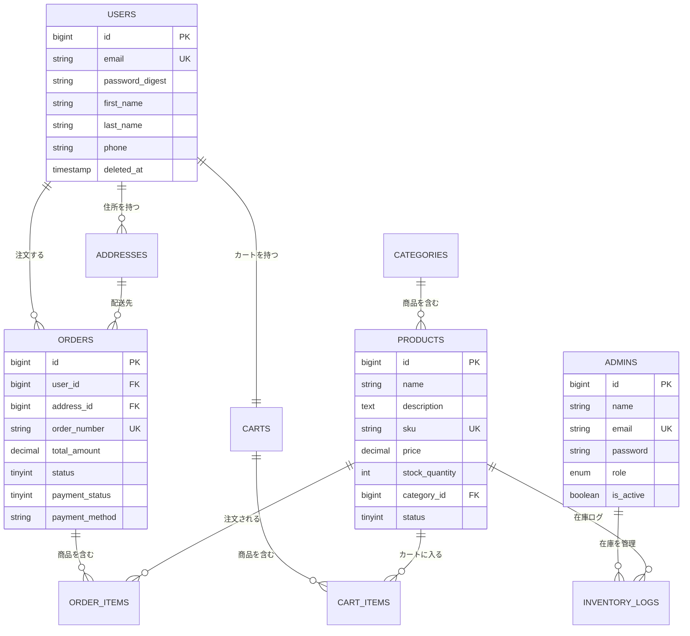

# システム設計書

## 1. システム概要

Amazon風のECサイトを構築するプロジェクトです。
ユーザー向けの機能と管理者向けの機能を、それぞれ別のバックエンドAPIで分けています。

## 2. アーキテクチャ

### システム構成図

```
  ブラウザ (React)
      |
      |  API通信
      |
  +---+---+--------+
  |                 |
  v                 v
User API        Admin API
(Rails)         (Laravel)
  |                 |
  +---+---+---------+
      |
      v
   MySQL 8.0
      |
   Redis
```

### アーキテクチャ選定理由

**なぜマイクロサービスにしたか**

課題の要件で「ユーザー側はRails、管理側はLaravel」と指定されていたので、自然とマイクロサービス構成になりました。
分けることでお互いの変更が影響しにくくなるメリットがあります。

**フロントエンド: React + TypeScript**

- 課題の指定技術
- TypeScriptを使うことで、型チェックによるバグ防止ができる
- Material-UIを使ってデザインを整えた

**ユーザー向けAPI: Rails（Sinatra）**

- 課題の指定技術
- RESTfulなAPI開発がしやすい
- ActiveRecordでDBアクセスが簡単に書ける

**管理者向けAPI: Laravel**

- 課題の指定技術
- Eloquent ORMが使いやすい
- JWT認証のライブラリが充実している

**データベース: MySQL 8.0**

- 課題の指定技術
- ECサイトではトランザクションが重要なのでRDBMSを選択
- ACID特性で注文データの整合性を保証できる

**セッション: Redis**

- 課題の指定（ファイル保存NG）
- メモリ上で動作するので高速

## 3. データベース設計

### ER図



### 設計で意識したこと

- **外部キー制約**: テーブル間の関連を外部キーで保証
- **インデックス**: 検索でよく使うカラム（email, sku, category_id等）にインデックスを設定
- **ソフトデリート**: ユーザーは論理削除（deleted_at）で対応。データを残す
- **在庫管理**: stock_quantityの更新時にロックを使って同時購入に対応

## 4. API設計

RESTfulなAPI設計にしました。

### ユーザー向けAPI（Rails）

| メソッド | パス | 説明 |
|---------|------|------|
| POST | /api/auth/login | ログイン |
| POST | /api/auth/register | 会員登録 |
| GET | /api/products | 商品一覧 |
| GET | /api/products/:id | 商品詳細 |
| GET | /api/cart | カート表示 |
| POST | /api/cart/items | カートに追加 |
| POST | /api/orders | 注文作成 |
| GET | /api/orders | 注文履歴 |

### 管理者向けAPI（Laravel）

| メソッド | パス | 説明 |
|---------|------|------|
| POST | /api/admin/login | 管理者ログイン |
| GET | /api/admin/products | 商品一覧 |
| POST | /api/admin/products | 商品登録 |
| PUT | /api/admin/products/:id | 商品更新 |
| GET | /api/admin/inventory | 在庫一覧 |
| PUT | /api/admin/inventory/products/:id/stock | 在庫更新 |

## 5. 認証設計

JWT（JSON Web Token）による認証を実装しました。

1. ログイン時にJWTトークンを発行
2. クライアントはlocalStorageにトークンを保存
3. API呼び出し時にAuthorizationヘッダーにトークンを付与
4. サーバー側でトークンを検証して認証

トークンの有効期限は24時間に設定しています。

## 6. セキュリティ対策

- **JWT認証**: APIアクセスにトークン必須
- **CORS設定**: 許可されたオリジンのみアクセス可
- **パスワードハッシュ化**: bcryptで暗号化
- **入力バリデーション**: サーバー側で全入力を検証
- **SQLインジェクション対策**: パラメータ化クエリ（ORMが自動対応）
- **セッション管理**: Redisに保存（ファイル保存しない）

## 7. パフォーマンス対策

- **DBインデックス**: 検索頻度の高いカラムにインデックス設定
- **N+1対策**: includes/eager loadingでまとめてデータ取得
- **ページネーション**: 一覧APIで件数制限
- **楽観的ロック**: 在庫更新時の同時アクセス対策

## 8. 工夫した点

- 同時購入への対策として、在庫更新時に楽観的ロック（Rails）とバージョンチェック（Laravel）を実装した
- ユーザー向けAPIとAdmin APIで共通のDBを使いつつ、APIは完全に分離した
- フロントエンドはContext APIで状態管理し、認証情報やカート情報をグローバルに管理
- Material-UIでデザインを統一し、見た目を整えた
- Docker Composeで全サービスを一括起動できるようにした
- Makefileでよく使うコマンドをまとめた

## 9. 今後の改善点

- テストカバレッジをもっと上げたい
- 画像のアップロード・表示を改善したい
- 検索機能をもっと高度にしたい（全文検索など）
- エラーハンドリングを統一したい
