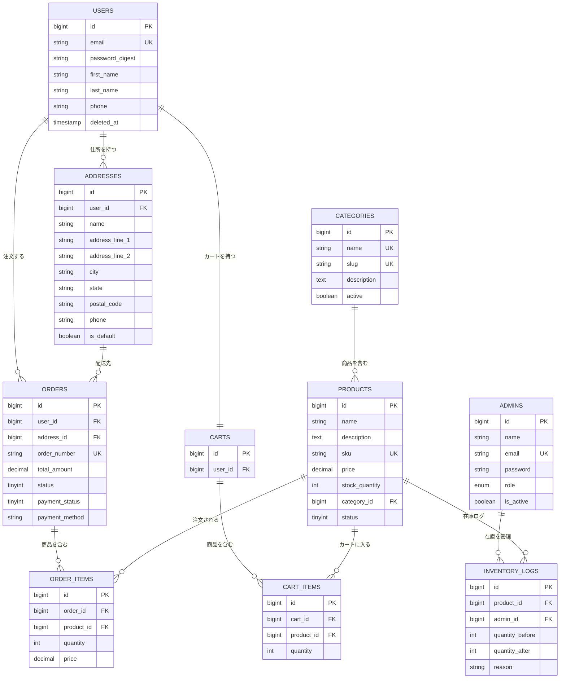

# システム設計書

## 1. システム概要

Amazon風のECサイトを構築するプロジェクトです。
ユーザー向けの機能と管理者向けの機能を、それぞれ別のバックエンドAPIで分離して実装しています。

## 2. アーキテクチャ

### システム構成図

```
  ブラウザ (React)
      |
      |  API通信
      |
  +---+---+--------+
  |                 |
  v                 v
User API        Admin API
(Rails)         (Laravel)
  |                 |
  +---+---+---------+
      |
      v
   MySQL 8.0
      |
   Redis
```

### アーキテクチャ選定理由

**マイクロサービス構成を採用した理由**

課題の要件で「ユーザー側はRails、管理側はLaravel」と指定されていたため、自然とマイクロサービス構成となりました。
サービスを分離することで、互いの変更が影響しにくくなるというメリットもあります。

**フロントエンド: React + TypeScript**

- 課題の指定技術
- TypeScriptを導入することで、型チェックによるバグの早期発見が可能になる
- Material-UIを採用し、UIの統一感を確保した

**ユーザー向けAPI: Rails**

- 課題の指定技術
- RESTfulなAPI開発に適している
- ActiveRecordにより、直感的なDB操作が可能

**管理者向けAPI: Laravel**

- 課題の指定技術
- Eloquent ORMによるDB操作が扱いやすい
- JWT認証のライブラリが充実している

**データベース: MySQL 8.0**

- 課題の指定技術
- ECサイトではトランザクションの信頼性が重要であるため、RDBMSを選択
- トランザクション機能があるので、注文データが途中で壊れにくい

**セッション: Redis**

- 課題の指定（ファイル保存は不可）
- メモリ上で動作するため、高速なセッション管理が可能

## 3. データベース設計

### ER図



## コンポーネント図

```
┌─────────────────────────────────────────────────┐
│                   Frontend                       │
│                  (React App)                     │
│                                                  │
│  ┌──────────┐ ┌──────────┐ ┌──────────────────┐ │
│  │  Pages   │ │Components│ │    Contexts       │ │
│  │ ・Home   │ │ ・Header │ │ ・AuthContext     │ │
│  │ ・Product│ │ ・Footer │ │ ・CartContext     │ │
│  │ ・Cart   │ │ ・Forms  │ │ ・ThemeContext    │ │
│  │ ・Order  │ │ ・Cards  │ │                   │ │
│  │ ・Admin  │ │          │ │                   │ │
│  └──────────┘ └──────────┘ └──────────────────┘ │
│  ┌──────────────────────────────────────────────┐│
│  │              Services (API通信)              ││
│  │  authService / productService / cartService  ││
│  │  orderService / adminAuthService ...         ││
│  └──────────────────────────────────────────────┘│
└──────────────┬────────────────────┬──────────────┘
               │ HTTP (JWT)         │ HTTP (JWT)
               ▼                    ▼
┌──────────────────────┐ ┌──────────────────────────┐
│   User API (Rails)   │ │   Admin API (Laravel)    │
│                      │ │                          │
│ ┌──────────────────┐ │ │ ┌──────────────────────┐ │
│ │   Controllers    │ │ │ │    Controllers       │ │
│ │ ・Auth           │ │ │ │ ・AdminAuth          │ │
│ │ ・Products       │ │ │ │ ・AdminProduct       │ │
│ │ ・Cart           │ │ │ │ ・AdminOrder         │ │
│ │ ・Orders         │ │ │ │ ・AdminInventory     │ │
│ │ ・Addresses      │ │ │ │ ・AdminCategory      │ │
│ └──────────────────┘ │ │ └──────────────────────┘ │
│ ┌──────────────────┐ │ │ ┌──────────────────────┐ │
│ │     Models       │ │ │ │      Models          │ │
│ │ ・User           │ │ │ │ ・Admin              │ │
│ │ ・Product        │ │ │ │ ・Product            │ │
│ │ ・Cart           │ │ │ │ ・Order              │ │
│ │ ・Order          │ │ │ │ ・InventoryLog       │ │
│ │ ・Address        │ │ │ │ ・Category           │ │
│ └──────────────────┘ │ │ └──────────────────────┘ │
└──────────┬───────────┘ └─────────────┬────────────┘
           │                           │
           ▼                           ▼
┌──────────────────────────────────────────────────┐
│                  MySQL 8.0                        │
│  (users, products, orders, carts, admins, ...)   │
└──────────────────────────────────────────────────┘
           │
           ▼
┌──────────────────────┐  ┌────────────────────────┐
│      Redis 7         │  │    Scheduler (cron)    │
│  (セッション管理)     │  │  毎朝9時にCSV出力      │
└──────────────────────┘  └────────────────────────┘
```

### 設計で意識したこと

- テーブル間のリレーションは外部キー制約で整合性を担保した
- email、SKUなど検索頻度の高いカラムにはインデックスを付与した
- ユーザーを削除するときは、実際にデータを消すのではなく、deleted_atカラムに日時を入れて「削除済み」とする方法にした（注文履歴などが消えてしまわないようにするため）
- 在庫の更新は、同時に購入が来てもデータがおかしくならないよう、ロックをかけて処理するようにしている

## 4. API設計

RESTfulなAPI設計を採用しました。

### ユーザー向けAPI（Rails）

| メソッド | パス | 説明 |
|---------|------|------|
| POST | /api/auth/login | ログイン |
| POST | /api/auth/register | 会員登録 |
| GET | /api/products | 商品一覧 |
| GET | /api/products/:id | 商品詳細 |
| GET | /api/cart | カート表示 |
| POST | /api/cart/items | カートに追加 |
| POST | /api/orders | 注文作成 |
| GET | /api/orders | 注文履歴 |

### 管理者向けAPI（Laravel）

| メソッド | パス | 説明 |
|---------|------|------|
| POST | /api/admin/login | 管理者ログイン |
| GET | /api/admin/products | 商品一覧 |
| POST | /api/admin/products | 商品登録 |
| PUT | /api/admin/products/:id | 商品更新 |
| GET | /api/admin/inventory | 在庫一覧 |
| PUT | /api/admin/inventory/products/:id/stock | 在庫更新 |

## 5. 認証設計

JWT（JSON Web Token）による認証を実装しました。

1. ログイン時にJWTトークンを発行
2. クライアントはlocalStorageにトークンを保存
3. API呼び出し時にAuthorizationヘッダーにトークンを付与
4. サーバー側でトークンを検証して認証

トークンの有効期限は24時間に設定しています。

## 6. セキュリティ対策

- **JWT認証**: APIアクセスにトークンを必須とし、不正なアクセスを防止
- **CORS設定**: 許可されたオリジンのみアクセス可能に制限
- **パスワードハッシュ化**: bcryptによる暗号化で安全に保存
- **入力バリデーション**: サーバー側で全入力値を検証し、不正なデータの登録を防止
- **SQLインジェクション対策**: RailsやLaravelのORMを使ってデータベースにアクセスしているため、フレームワーク側で対策されている
- **セッション管理**: Redisに保存し、Cookieの設定もセキュリティを意識した設定にしている

## 7. パフォーマンス対策

- **DBインデックス**: 検索頻度の高いカラムにインデックスを付与し、クエリの高速化を図った
- **N+1問題への対応**: 関連データをまとめて取得するようにした。最初は画面の表示が遅くなることがあり、調べてみるとSQLが大量に発行されていたので、includesを使って改善した
- **ページネーション**: 一覧APIではデータの取得件数を制限し、レスポンスサイズを抑えた
- **在庫の同時アクセス対策**: 同じ商品を同時に購入されたときにデータがおかしくならないよう、更新時にロックをかけるようにした

## 8. 工夫した点

- 同時に同じ商品が購入された場合に在庫がマイナスにならないようにする処理に最も苦労した。当初はSELECTで在庫を確認してからUPDATEする流れで実装していたが、タイミングによっては在庫が負の値になる可能性があることに気づき、Rails側ではwith_lockという機能を使い、Laravel側でもトランザクション内でロックをかけることで対応した
- User APIとAdmin APIで同一のデータベースを共有する構成とした。当初はDB自体を分離することも検討したが、データの整合性を維持するコストが大きくなると判断し、同一DBを採用した
- 状態管理についてはReduxの導入も検討したが、本プロジェクトの規模であればContext APIで十分と判断し、認証情報とカート情報をグローバルに管理する形とした
- CSSフレームワークにはMaterial-UIを採用した。独自でスタイリングを一から構築する時間的余裕がなかったため、統一感のあるUIを効率的に実現できるライブラリを選択した
- Laravelのコントローラーで毎回同じJSON形式のレスポンスを返す処理が重複していたため、ベースのControllerにヘルパーメソッドを定義し、共通化した
- Makefileを早い段階で作成し、docker-composeのコマンドを短縮できるようにした。開発効率の改善に役立った

## 9. 苦労した点・今後の改善点

- RailsとLaravelを両方使うのは、思っていた以上に大変で、片方の書き方に慣れてきたところでもう片方に切り替えるという繰り返しで、頭の切り替えがなかなかうまくいかない場面が多かった。
- 両フレームワークが同じDBを見ているので、Rails側でテーブルを作成してLaravel側では微調整だけするという方針で進めたが、もっとうまいやり方があったかもしれないと感じた。
- テストはかなり時間を取られた。コントローラーのテストは特に認証まわりのセットアップで何度もハマってしまい、思ったように進まなかった。
- 商品検索はLIKE句での部分一致で実装しているので、データが増えてきたときに遅くなる可能性がある。この部分もSQLなどの知識を深め、よりよい実装にしていきたい。
